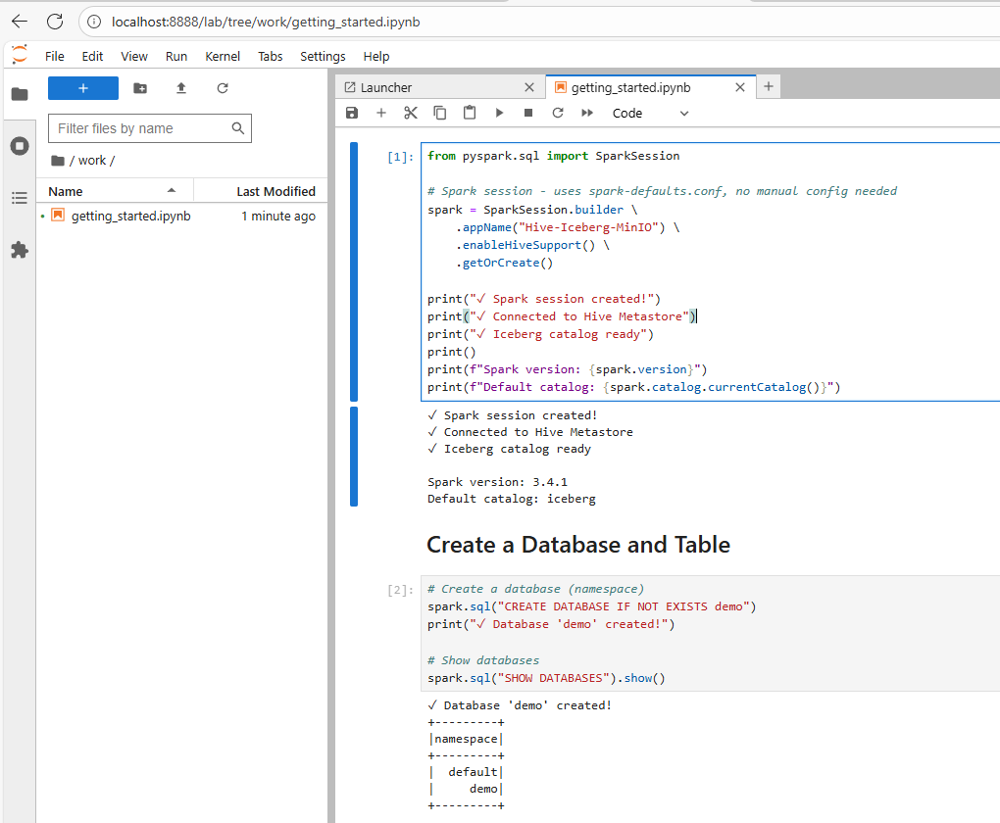
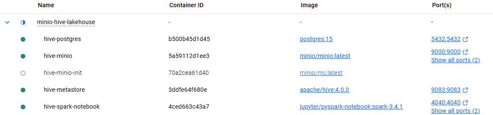

# PART-A: Core Lakehouse Infrastructure

**← [Back to Main Repository](../README.md)**

This is the **foundation layer** of the MinIO + Hive Metastore + Iceberg Lakehouse. It provides a Docker-based setup with MinIO for object storage, Hive Metastore as the catalog, PostgreSQL for metadata, and Jupyter notebook with PySpark for interactive querying. The setup is fully on-premises with no cloud dependencies, giving you better understanding of components compared to cloud services.

## Why This Setup?

The recommended approach for a lakehouse catalog using Iceberg is Polaris. However, if you've tried the Polaris-based setup, you know the pain - every time the container restarts, you get new credentials and have to reconfigure everything. This is not a practical approach. You need a solid setup that doesn't require changes every time something restarts. Hence, Hive is used as the catalog. This is also a standard setup with proven compatibility. Hive is not an odd component in the architecture.


**How it flows:**
1. You write SQL in Jupyter
2. Spark asks Hive Metastore "where's this table?"
3. Hive checks PostgreSQL and returns the location
4. Spark reads Iceberg metadata from MinIO to find data files
5. Spark reads/writes Parquet files directly to MinIO


## First time setup

### macOS / Linux
```bash
# Open terminal, navigate to this folder, and run:
./setup.sh
```

Note: You may need to grant execute permissions first:
```bash
chmod +x setup.sh start.sh stop.sh nuke.sh
./setup.sh
```

If all works well, you will be able to open the Jupyter notebook and run Spark queries.




### Windows (PowerShell)

```powershell
powershell -ExecutionPolicy Bypass -File .\setup.ps1
```

This downloads required JARs, creates all containers, and waits for everything to be healthy.

Open http://localhost:8888 and run `notebooks/getting_started.ipynb`.

### Manual Start (if you prefer)

#### macOS / Linux

```bash
# One-time setup: download required JARs
mkdir -p lib
curl -sL -o lib/postgresql-42.6.0.jar https://jdbc.postgresql.org/download/postgresql-42.6.0.jar
curl -sL -o lib/hadoop-aws-3.3.4.jar https://repo1.maven.org/maven2/org/apache/hadoop/hadoop-aws/3.3.4/hadoop-aws-3.3.4.jar
curl -sL -o lib/aws-java-sdk-bundle-1.12.262.jar https://repo1.maven.org/maven2/com/amazonaws/aws-java-sdk-bundle/1.12.262/aws-java-sdk-bundle-1.12.262.jar

# Start infrastructure
docker-compose up -d

# Wait for "Starting Hive Metastore Server" in logs
docker-compose logs -f hive-metastore

# Start Jupyter (in a new terminal)
docker-compose -f spark-notebook.yml up -d
```

#### Windows (PowerShell)

```powershell
# One-time setup: download required JARs
New-Item -ItemType Directory -Path lib -Force
Invoke-WebRequest -Uri "https://jdbc.postgresql.org/download/postgresql-42.6.0.jar" -OutFile "lib\postgresql-42.6.0.jar"
Invoke-WebRequest -Uri "https://repo1.maven.org/maven2/org/apache/hadoop/hadoop-aws/3.3.4/hadoop-aws-3.3.4.jar" -OutFile "lib\hadoop-aws-3.3.4.jar"
Invoke-WebRequest -Uri "https://repo1.maven.org/maven2/com/amazonaws/aws-java-sdk-bundle/1.12.262/aws-java-sdk-bundle-1.12.262.jar" -OutFile "lib\aws-java-sdk-bundle-1.12.262.jar"

# Start infrastructure
docker-compose up -d

# Wait for "Starting Hive Metastore Server" in logs
docker-compose logs -f hive-metastore

# Start Jupyter (in a new terminal)
docker-compose -f spark-notebook.yml up -d
```

## Project Structure

```
MINIO-HIVE-LAKEHOUSE/
├── docker-compose.yml      # PostgreSQL, MinIO, Hive Metastore
├── spark-notebook.yml      # Jupyter + Spark
├── setup.sh               # First-time setup (macOS/Linux)
├── setup.ps1              # First-time setup (Windows)
├── start.sh               # Start stopped containers (macOS/Linux)
├── start.ps1              # Start stopped containers (Windows)
├── stop.sh                # Stop containers (macOS/Linux)
├── stop.ps1               # Stop containers (Windows)
├── nuke.sh                # Delete everything (macOS/Linux)
├── nuke.ps1               # Delete everything (Windows)
├── conf/
│   ├── hive-site.xml      # Hive Metastore configuration
│   ├── core-site.xml      # Hadoop S3A configuration
│   └── spark-defaults.conf # Spark + Iceberg configuration
├── lib/                   # Downloaded JARs (gitignored)
│   ├── postgresql-42.6.0.jar
│   ├── hadoop-aws-3.3.4.jar
│   └── aws-java-sdk-bundle-1.12.262.jar
└── notebooks/
    └── getting_started.ipynb
```


## Services

| Service | URL | Purpose |
|---------|-----|---------|
| Jupyter | http://localhost:8888 | Write and run Spark SQL |
| MinIO Console | http://localhost:9001 | Browse your data files |
| Spark UI | http://localhost:4040 | Monitor running jobs (active during queries) |
| Hive Metastore | localhost:9083 | Catalog service (internal) |
| PostgreSQL | localhost:5432 | Metadata storage (internal) |



**MinIO credentials:** `minioadmin` / `minioadmin`

## What Persists Across Restarts?

**Everything.** Unlike the Polaris setup, nothing is lost when you restart Docker.

Docker volumes store:
- **postgres_data** - All your databases, tables, schemas, column definitions
- **minio_data** - Your actual Parquet files and Iceberg metadata

Restart Docker, restart your machine, come back a week later—your data is exactly where you left it. No setup scripts to re-run, no credentials to update, no catalogs to recreate.

This is how production systems work. You set them up once and they keep running.

## Daily Usage

### macOS / Linux

```bash
# End of day - stop containers (preserves everything)
./stop.sh

# Next day - start containers again
./start.sh
```

### Windows (PowerShell)

```powershell
# End of day - stop containers (preserves everything)
.\stop.ps1

# Next day - start containers again
.\start.ps1
```

Containers are stopped but preserved. All your data, tables, and settings remain intact.

## Complete Cleanup

To wipe everything and start completely fresh:

### macOS / Linux

```bash
./nuke.sh
```

### Windows (PowerShell)

```powershell
.\nuke.ps1
```

This removes all containers, volumes, and data. Run `./setup.sh` (or `.\setup.ps1` on Windows) afterwards to create fresh containers.


## Why These Specific JARs?

The `apache/hive:4.0.0` Docker image is minimal—it doesn't include drivers for PostgreSQL or S3-compatible storage. We mount three JARs:

| JAR | Purpose |
|-----|---------|
| `postgresql-42.6.0.jar` | JDBC driver for Hive to connect to PostgreSQL |
| `hadoop-aws-3.3.4.jar` | S3AFileSystem class for MinIO/S3 storage |
| `aws-java-sdk-bundle-1.12.262.jar` | AWS SDK that hadoop-aws depends on |

Without these, Hive Metastore fails with cryptic ClassNotFoundException errors. The `setup.sh` script downloads them automatically on first run.

## Troubleshooting

### Hive Metastore won't start

**Most common cause:** Missing JARs. Check they exist:

**macOS / Linux:**
```bash
ls -la lib/
```

**Windows (PowerShell):**
```powershell
Get-ChildItem lib\
```

You should see three JAR files. If any are missing, download them:

**macOS / Linux:**
```bash
mkdir -p lib
curl -sL -o lib/postgresql-42.6.0.jar https://jdbc.postgresql.org/download/postgresql-42.6.0.jar
curl -sL -o lib/hadoop-aws-3.3.4.jar https://repo1.maven.org/maven2/org/apache/hadoop/hadoop-aws/3.3.4/hadoop-aws-3.3.4.jar
curl -sL -o lib/aws-java-sdk-bundle-1.12.262.jar https://repo1.maven.org/maven2/com/amazonaws/aws-java-sdk-bundle/1.12.262/aws-java-sdk-bundle-1.12.262.jar
```

**Windows (PowerShell):**
```powershell
New-Item -ItemType Directory -Path lib -Force
Invoke-WebRequest -Uri "https://jdbc.postgresql.org/download/postgresql-42.6.0.jar" -OutFile "lib\postgresql-42.6.0.jar"
Invoke-WebRequest -Uri "https://repo1.maven.org/maven2/org/apache/hadoop/hadoop-aws/3.3.4/hadoop-aws-3.3.4.jar" -OutFile "lib\hadoop-aws-3.3.4.jar"
Invoke-WebRequest -Uri "https://repo1.maven.org/maven2/com/amazonaws/aws-java-sdk-bundle/1.12.262/aws-java-sdk-bundle-1.12.262.jar" -OutFile "lib\aws-java-sdk-bundle-1.12.262.jar"
```

Then restart:

```bash
docker-compose down && docker-compose up -d
```

### "ClassNotFoundException: org.postgresql.Driver"

PostgreSQL JDBC driver is missing. Download it:

```bash
curl -sL -o lib/postgresql-42.6.0.jar https://jdbc.postgresql.org/download/postgresql-42.6.0.jar
docker-compose restart hive-metastore
```

### "ClassNotFoundException: org.apache.hadoop.fs.s3a.S3AFileSystem"

Hadoop AWS JARs are missing. Download them:

```bash
curl -sL -o lib/hadoop-aws-3.3.4.jar https://repo1.maven.org/maven2/org/apache/hadoop/hadoop-aws/3.3.4/hadoop-aws-3.3.4.jar
curl -sL -o lib/aws-java-sdk-bundle-1.12.262.jar https://repo1.maven.org/maven2/com/amazonaws/aws-java-sdk-bundle/1.12.262/aws-java-sdk-bundle-1.12.262.jar
docker-compose restart hive-metastore
```

### Spark can't connect to Metastore

Make sure Hive Metastore is actually running:

```bash
docker-compose logs hive-metastore | tail -20
```

Look for "Starting Hive Metastore Server". If you see errors, check the JAR files above.

Also verify both compose files use the same network:

```bash
docker network ls | grep dasnet
```

### MinIO bucket doesn't exist

The `minio-init` container creates the `warehouse` bucket automatically. Check if it ran:

```bash
docker-compose logs minio-init
```

Should show "Bucket warehouse created successfully".


## What You Can Do

Once running, you have a full Iceberg lakehouse with:

- **ACID transactions** - No partial writes, no corruption
- **Schema evolution** - Add/drop/rename columns without rewriting data
- **Time travel** - Query any historical version of your data
- **Partition evolution** - Change partitioning without rewriting data
- **Hidden partitioning** - Write `WHERE date = '2024-01-01'`, not `WHERE year=2024 AND month=01 AND day=01`

Open the `getting_started.ipynb` notebook to see examples of all these features.
