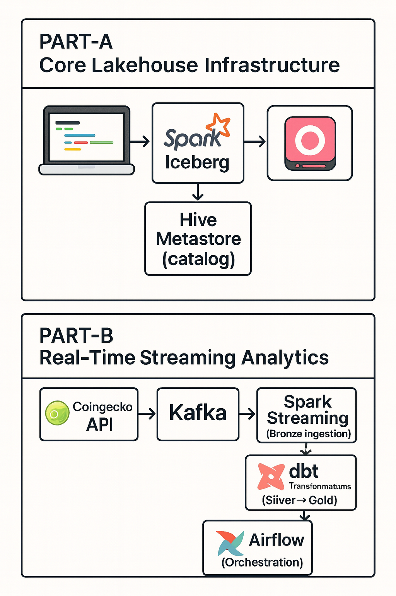

# MinIO + Hive Metastore + Iceberg Lakehouse

## Overview

Welcome to my repo. Here, I tried to create a complete, production-ready data lakehouse running locally with Docker on Mac, Linux, or Windows.

**Key Specialties:**
- **On-Premises**: Fully self-hosted—no cloud dependencies. Works both on Windows and MAC(Apple silicon)
- **Open Source Stack**: Apache Iceberg, MinIO, Hive Metastore, Spark, Kafka, Airflow
- **Scalable Architecture**: Even though the design is local on docker. The same architecture can be scalled up for real production use.

**What You'll Learn:**
- Building modern data lakehouse architectures
- Managing metadata catalogs with Hive Metastore
- Real-time streaming pipelines with Kafka and Spark
- Data transformations with dbt and Spark SQL
- Orchestrating workflows with Airflow

## Start Here: Choose Your Path

This repository is organized into two main parts. **Start with PART-A first**, then optionally add PART-B.

| Part | Purpose | Documentation |
|------|---------|---------------|
| **PART-A** | Foundation layer: Storage, metadata catalog, processing engine | 📖 [Go to PART-A →](PART-A/README.md) |
| **PART-B** | Real-time analytics: Streaming, transformations, orchestration | 📖 [Go to PART-B →](PART-B/ReadMe.md) |


## Quick Start

### 1. Setup Core Infrastructure (PART-A)

**First time only:** Use setup scripts to download required JARs and create containers.

| OS         | Command(s)                                                                                  |
|------------|------------------------------------------------------------------------------------------|
| Mac/Linux  | `cd PART-A`<br>`chmod +x setup.sh`<br>`./setup.sh`                                        |
| Windows    | `cd PART-A`<br>`Set-ExecutionPolicy -Scope Process -ExecutionPolicy Bypass`<br>`./setup.ps1` |

**What setup does:**
- Downloads 3 required JAR files (~50MB) to `lib/` folder
- Creates and starts all containers
- Waits for services to be healthy
- Starts Jupyter notebook

**Daily use after setup:** Use start scripts (much faster, no downloads).

| OS         | Command(s)                     |
|------------|--------------------------------|
| Mac/Linux  | `cd PART-A`<br>`./start.sh`    |
| Windows    | `cd PART-A`<br>`./start.ps1`   |

This creates the base lakehouse with MinIO, Hive, and Spark.


### 2. Access Services

| Service            | URL                    | Credentials                |
|--------------------|------------------------|----------------------------|
| Jupyter Notebook   | http://localhost:8888  | No password                |
| MinIO Console      | http://localhost:9001  | minioadmin / minioadmin    |
| Spark UI           | http://localhost:4040  | (Active during queries)    |

### 3. Run Streaming Analytics (Optional)

| OS         | Command(s)                                                                                 |
|------------|--------------------------------------------------------------------------------------------|
| Mac/Linux  | `cd PART-B`<br>`chmod +x setup.sh`<br>`./setup.sh`                                         |
| Windows    | `cd PART-B`<br>`Set-ExecutionPolicy -Scope Process -ExecutionPolicy Bypass`<br>`./setup.ps1`|

## Daily Workflow

| Step                | Mac/Linux Command(s)           | Windows Command(s)           |
|---------------------|-------------------------------|------------------------------|
| Start PART-A        | `cd PART-A`<br>`./start.sh`   | `cd PART-A`<br>`./start.ps1` |
| Stop PART-A         | `cd PART-A`<br>`./stop.sh`    | `cd PART-A`<br>`./stop.ps1`  |
| Cleanup PART-A      | `cd PART-A`<br>`./nuke.sh`    | `cd PART-A`<br>`./nuke.ps1`  |
| Start PART-B        | `cd PART-B`<br>`./setup.sh`   | `cd PART-B`<br>`./setup.ps1` |
| Access Kafka UI     | http://localhost:8080         | http://localhost:8080        |
| Access Airflow      | http://localhost:8081         | http://localhost:8081        |

## Architecture

| Component | Description |
|-----------|-------------|
| PART-A    | MinIO (object storage), Hive Metastore (catalog), PostgreSQL (metadata), Spark Notebook |
| PART-B    | Kafka (streaming), Spark Structured Streaming, dbt (transformations), Airflow (orchestration) |



## What Persists?

| Volume         | Description                       |
|---------------|-----------------------------------|
| postgres_data  | Table metadata and schemas        |
| minio_data     | Parquet/Iceberg data files        |

Stopping containers preserves data. Only `./nuke.sh`/`./nuke.ps1` removes data permanently.

### After Machine Restart

All services are configured with `restart: unless-stopped` policy. This means:
- ✅ **Containers restart automatically** after machine reboot
- ✅ **All data persists** in Docker volumes
- ⚠️ **Wait 30-60 seconds** for all services to become healthy

If any service fails to start after reboot:
```bash
# Check container status
docker ps -a

# Restart all services
cd PART-A
./start.sh    # Mac/Linux
./start.ps1   # Windows
```

## Network Architecture

| Network | Role |
|---------|------|
| dasnet  | Created by PART-A; PART-B connects for cross-service access |

## Prerequisites

| Requirement         | Details                       |
|--------------------|-------------------------------|
| Docker             | Desktop (Mac/Windows) or Engine (Linux) |
| RAM                | 8GB+ available for Docker      |
| Disk Space         | 10GB+ free                     |

## Troubleshooting

| Issue                        | Solution/Check |
|------------------------------|----------------|
| PART-A won't start           | See [PART-A/README.md](PART-A/README.md#troubleshooting).<br>Common: missing JARs, ports in use (5432, 9000, 9001, 8888), not enough Docker memory |
| PART-B can't connect to PART-A| Ensure PART-A is running (`cd PART-A`, `docker-compose ps`). If not, restart PART-A (`./stop.sh`/`./start.sh` or `./stop.ps1`/`./start.ps1`). Then retry PART-B setup. |
| Network not found error       | Start PART-A first to create `dasnet` network |

## Contributing

Found a bug? Have a suggestion? Open an issue!

## License

MIT License - Use freely for learning and commercial projects.
